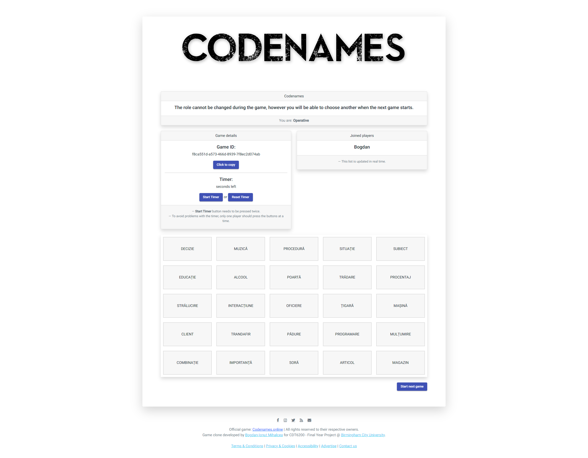

# codenames_game
> Codenames clone developed for my dissertation in my final year at [_Birmingham City University_](https://bcu.ac.uk). 
> Live demo [_here_](https://codenames.bogdanmihalcea.ro).

## Table of Contents
* [General Info](#general-information)
* [Technologies Used](#technologies-used)
<!--* [Features](#features)-->
* [Screenshots](#screenshots)
* [Setup](#setup)
* [Usage](#usage)
* [Project Status](#project-status)
* [Room for Improvement](#room-for-improvement)
* [Acknowledgements](#acknowledgements)
* [Contact](#contact)

## General Information
- Provide general information about your project here.
- What problem does it (intend to) solve?
- What is the purpose of your project?
- Why did you undertake it?

The idea of this project came up after several experiences which included silly but real problems regarding a real-life board game, all the way from losing crucial pieces of the game (think pawns for example), which were needed to be able to play the game, as well as discussions of the actual rules. My solution to this problem was to develop an online game which would solve all those problems.

## Technologies Used
- Frontend: Angular
- Backend: Node.JS with Express, Socket.io

<!--
## Features
List the ready features here:
- Awesome feature 1
- Awesome feature 2
- Awesome feature 3
-->

## Screenshots

<!-- If you have screenshots you'd like to share, include them here. -->

## Setup
The project dependencies can be found in package.json

In order to deloy the game, you need to build the frontend as production: 

`ng build`

Then use the generated files with your preferred web server.

Backend deployment:

`npm install`
`npm ci --only=production`
`node index.js`

A docker version of the backend can be found [here](https://hub.docker.com/r/bogdanmihalcea/codenames)
The dockerfile is included in he backend folder.

## Usage
Get 4 people together and start playing!

## Project Status
Project is: _complete_ & _no longer being worked on_.

## Room for Improvement
Include areas you believe need improvement / could be improved. Also add TODOs for future development.

Room for improvement:
- A lot of the code could be cleaned and restructured into fewer lines and made easier to understand.
- Game could be improved so that the server could choose the team & role for each player to give some variety.
- Player turns could be restricted to the timer currently implemented.
- Implement the ability to register for an account, this would enable the players to have unique nicknames. Also, implementing name restrictions would probably be a good idea.
- Implement the ability to play with random people, by implementing public lobbies. This would also require some sort of live-chat built-in or via external communication services (e.g., Discord, Teams), as this game is of a social nature.

## Acknowledgements
- This project was inspired by [the official codenames online game](https://codenames.online/).

## Contact
Created by [@Bogdan Mihalcea](https://bogdanmihalcea.ro/) - feel free to contact me!